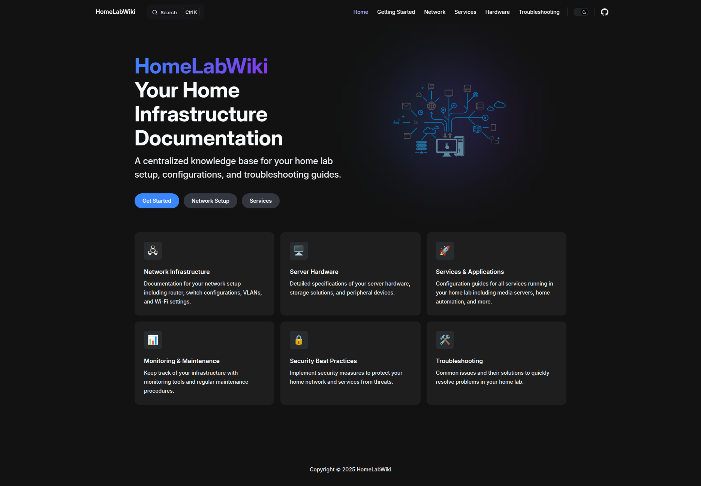

# HomeLabWiki - Your Home Infrastructure Documentation

**HomeLabWiki** is a VitePress-based documentation platform designed to be a centralized knowledge base for your home lab setup, configurations, and troubleshooting guides.

<p align="center">
  
</p>

## Description

This wiki is built to organize and document everything related to your home lab infrastructure setup, including servers, networks, services, and other components. You will find useful information about:

- Hardware and software configurations
- Server and network settings
- Troubleshooting guides
- Best practices and solutions for various home lab challenges

## Features

- **Complete documentation** for your home lab infrastructure
- **User-friendly interface** with quick and organized navigation
- **Tracking and managing configuration and maintenance steps** for various services
- **Troubleshooting guides** for common home lab issues
- **Mobile-friendly version** with responsive design

## Technical Specifications

- **Platform:** [VitePress](https://vitepress.vuejs.org/) - A modern framework for documentation
- **Frontend:** HTML, CSS (Tailwind CSS)
- **Backend:** Static site generated at build time, no external server needed
- **Installation:** Simple setup using Node.js and NPM
- **Hosting:** Can be hosted on any static server (e.g., GitHub Pages, Netlify, Vercel)
- **Languages used:** Markdown for documentation

## Installation and Deployment

### 1. Clone the Repository

Clone the repository locally:

```bash
git clone https://github.com/frozendark01/HomeLab-Wiki.git
cd HomeLab-Wiki
npm install
npm run docs:dev
Access the application at http://localhost:5173.
---------------------------
Build and Deploy
npm run docs:build
```

## Contributing

Contribute to this wiki by adding new information or fixing errors. All contributions are welcome! 
Please follow the steps below:
- Fork the repository.
- Create a new branch.
- Add/edit the documentation.
- Open a pull request.
        
[](https://www.buymeacoffee.com/frozendark)
