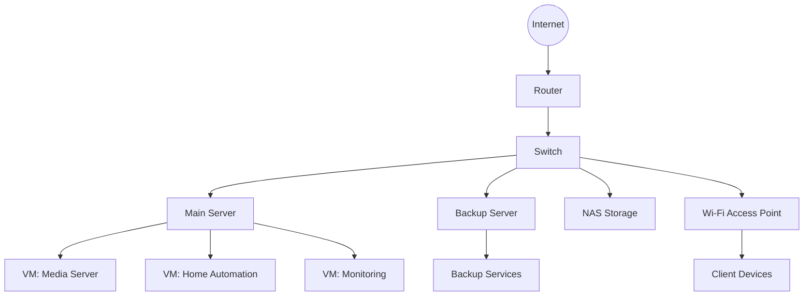

# Getting Started

Welcome to your HomeLabWiki! This guide will help you navigate through the documentation and understand the structure of your home lab infrastructure.

## Wiki Organization

This wiki is organized into several main sections:

- **Network**: Everything related to your network infrastructure
- **Services**: Documentation for all services and applications running in your home lab
- **Hardware**: Details about your physical hardware components
- **Troubleshooting**: Common issues and their solutions

## Network Diagram

Below is a high-level diagram of your home network infrastructure:

## IP Address Scheme

| Network | VLAN | IP Range | Purpose |
|---------|------|----------|---------|
| Management | 10 | 10.0.10.0/24 | Infrastructure management |
| Servers | 20 | 10.0.20.0/24 | Server VMs and containers |
| IoT | 30 | 10.0.30.0/24 | Smart home devices |
| Guest | 40 | 10.0.40.0/24 | Guest network |
| Media | 50 | 10.0.50.0/24 | Media streaming devices |

## Quick Start

If you're setting up a new device or service, follow these general steps:

1. Determine which network/VLAN the device should belong to
2. Assign a static IP address from the appropriate range
3. Update the documentation with the new device details
4. Configure any necessary firewall rules
5. Set up monitoring for the new device

## Documentation Standards

When adding to this wiki, please follow these standards:

- Use clear, concise language
- Include configuration files when relevant
- Document all changes to the infrastructure
- Add troubleshooting steps for common issues
- Keep diagrams and network maps up to date