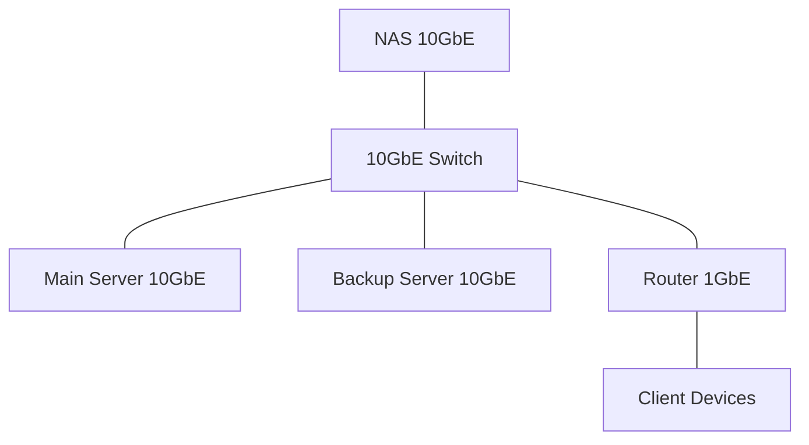

# Storage Solutions

This page documents the storage infrastructure in your home lab environment.

## Storage Overview

Your home lab employs a multi-tiered storage strategy with different solutions optimized for various workloads:

1. **Primary Storage**: TrueNAS Scale NAS with large ZFS pool
2. **Server Local Storage**: NVMe and SAS drives for VM hosting
3. **Backup Storage**: Dedicated backup server with large RAID array
4. **Archive Storage**: External drives for cold storage

## Primary Storage (NAS)

### Hardware

- **System**: Custom 4U Storage Server
- **CPU**: Intel Xeon E-2278G (8 cores, 16 threads)
- **RAM**: 64GB DDR4 ECC
- **Boot Drives**: 2 x 500GB Samsung 870 EVO SSD (ZFS mirror)
- **Cache Drives**: 2 x 1TB Samsung 980 Pro NVMe SSD (ZFS mirror)
- **Data Drives**: 12 x 16TB Seagate EXOS X16 Enterprise HDD
- **HBA**: LSI 9300-16i (IT mode)
- **Network**: 10GbE SFP+ primary, 2 x 1GbE secondary

### ZFS Configuration

#### Pool Layout

```
main-pool (RAIDZ2)
├── 12 x 16TB HDDs
│   ├── 192TB raw capacity
│   └── 160TB usable capacity
```

#### Dataset Structure

```
main-pool/
├── media/
│   ├── movies/
│   ├── tv/
│   ├── music/
│   └── photos/
├── backups/
│   ├── server-backups/
│   ├── vm-backups/
│   └── client-backups/
├── documents/
│   ├── personal/
│   ├── financial/
│   └── projects/
├── vm-storage/
│   ├── main-server/
│   └── backup-server/
└── isos/
```

#### ZFS Properties

| Dataset | Compression | Deduplication | Recordsize | Sync | Quota |
|---------|-------------|---------------|------------|------|-------|
| media | lz4 | Off | 1M | Standard | 100TB |
| backups | zstd | Off | 1M | Standard | 40TB |
| documents | zstd | Off | 128K | Always | 5TB |
| vm-storage | lz4 | Off | 64K | Always | None |
| isos | lz4 | Off | 1M | Standard | 1TB |

### Performance Metrics

- **Sequential Read**: 2.2 GB/s
- **Sequential Write**: 1.8 GB/s
- **Random Read (4K)**: 3,500 IOPS
- **Random Write (4K)**: 2,800 IOPS
- **Network Throughput**: 9.7 Gbps (10GbE)
- **Typical Latency**: 0.5-2ms

### Sharing Protocols

| Protocol | Purpose | Authentication | Encryption |
|----------|---------|----------------|------------|
| SMB/CIFS | Windows clients, general file sharing | Active Directory | Required |
| NFS | VM storage, Linux clients | IP-based | Not available |
| iSCSI | Block storage for servers | CHAP | Optional |
| S3 | Object storage | API keys | Required |

## Server Local Storage

### Main Server

- **Boot/OS**: 2 x 1TB Samsung 980 Pro NVMe SSD (RAID 1)
- **VM Storage**: 4 x 4TB Seagate IronWolf Pro (RAID 10)
- **Total Capacity**: 1TB OS, 8TB VM storage
- **Performance**:
  - NVMe: 6.5 GB/s read, 5.0 GB/s write
  - HDD RAID: 800 MB/s read, 750 MB/s write

### Backup Server

- **Boot/OS**: 2 x 500GB Samsung 870 EVO SSD (RAID 1)
- **Backup Storage**: 6 x 8TB WD Red Pro (RAID 6)
- **Total Capacity**: 500GB OS, 32TB backup storage
- **Performance**:
  - SSD: 550 MB/s read, 520 MB/s write
  - HDD RAID: 700 MB/s read, 500 MB/s write

## Storage Networking

### Network Topology



### Network Performance

| Connection | Theoretical Max | Actual Throughput | Latency |
|------------|-----------------|-------------------|---------|
| NAS ↔ Main Server | 10 Gbps | 9.7 Gbps | 0.2ms |
| NAS ↔ Backup Server | 10 Gbps | 9.4 Gbps | 0.2ms |
| NAS ↔ Client Devices | 1 Gbps | 940 Mbps | 0.5ms |
| Main Server ↔ Backup Server | 10 Gbps | 9.5 Gbps | 0.2ms |

## Backup Strategy

### Backup Tiers

1. **Tier 1**: Daily incremental backups to backup server
2. **Tier 2**: Weekly full backups to backup server
3. **Tier 3**: Monthly archives to external storage
4. **Tier 4**: Quarterly offsite backups

### Backup Software

- **VM Backups**: Proxmox Backup Server
- **File Backups**: Duplicati
- **NAS Replication**: TrueNAS built-in replication
- **Client Backups**: Veeam Agent

### Retention Policy

| Backup Type | Retention Period | Storage Location |
|-------------|------------------|------------------|
| Daily Incrementals | 14 days | Backup Server |
| Weekly Full | 8 weeks | Backup Server |
| Monthly Archives | 12 months | Backup Server + External |
| Quarterly Offsite | 2 years | Offsite Storage |

## Storage Monitoring

### Monitoring Tools

- **SMART Monitoring**: smartd on all systems
- **ZFS Health**: TrueNAS built-in monitoring
- **Performance Metrics**: Prometheus + Grafana
- **Capacity Trending**: Custom Grafana dashboard
- **Alerts**: Email + Telegram notifications

### Alert Thresholds

| Metric | Warning Threshold | Critical Threshold |
|--------|-------------------|-------------------|
| Disk Space | 80% | 90% |
| SMART Errors | Any | Any |
| ZFS Scrub Errors | Any | Any |
| Read/Write Latency | 10ms | 20ms |
| Temperature | 45°C | 50°C |

## Disaster Recovery

### Recovery Scenarios

#### Scenario 1: Single Disk Failure

1. ZFS will continue to operate in degraded mode
2. Replace failed disk
3. ZFS will resilver automatically
4. Estimated recovery time: 24-48 hours

#### Scenario 2: Multiple Disk Failures (Beyond Redundancy)

1. Restore from backup server
2. Prioritize critical data first
3. Estimated recovery time: 48-72 hours

#### Scenario 3: Complete NAS Failure

1. Temporary NAS can be configured on backup server
2. Critical services restored from backups
3. New hardware acquisition and setup
4. Estimated recovery time: 3-5 days

### Recovery Testing

- Quarterly recovery drills
- Test restoration of random files
- Validate VM recovery
- Document recovery time and issues

## Future Expansion Plans

### Short-term (6-12 months)

- Add 4 additional 16TB drives to NAS (Q4 2025)
- Upgrade NAS RAM to 128GB
- Implement automated tiering between NVMe and HDD

### Long-term (1-3 years)

- Migrate to larger capacity drives (20TB+)
- Evaluate transition to all-flash for critical workloads
- Implement secondary NAS for real-time replication

## Storage Performance Tuning

### ZFS Tuning Parameters

```
# ARC Size Limits
echo "options zfs zfs_arc_min=8589934592" >> /etc/modprobe.d/zfs.conf
echo "options zfs zfs_arc_max=34359738368" >> /etc/modprobe.d/zfs.conf

# Prefetch Tuning
echo "options zfs zfs_prefetch_disable=0" >> /etc/modprobe.d/zfs.conf

# Transaction Group Timeout
echo "options zfs zfs_txg_timeout=5" >> /etc/modprobe.d/zfs.conf
```

### NFS Tuning

```
# /etc/nfs.conf
[nfsd]
threads=16
tcp=y
udp=n

[mountd]
manage-gids=y

[statd]
port=32765
outgoing-port=32766

[lockd]
port=32768
udp-port=32768
```

### SMB Tuning

```
# /etc/samba/smb.conf
[global]
socket options = TCP_NODELAY IPTOS_LOWDELAY SO_RCVBUF=131072 SO_SNDBUF=131072
read raw = yes
write raw = yes
server min protocol = SMB2
server max protocol = SMB3
min receivefile size = 16384
aio read size = 1
aio write size = 1
use sendfile = yes
```

## Storage Maintenance Schedule

| Task | Frequency | Duration | Impact |
|------|-----------|----------|--------|
| ZFS Scrub | Monthly | 24-36 hours | Minimal |
| SMART Extended Tests | Monthly | 8-12 hours | None |
| Filesystem Cleanup | Quarterly | 2-4 hours | None |
| Firmware Updates | As needed | 1-2 hours | Downtime |
| Performance Analysis | Quarterly | 2 hours | None |
| Capacity Planning | Quarterly | 1 hour | None |