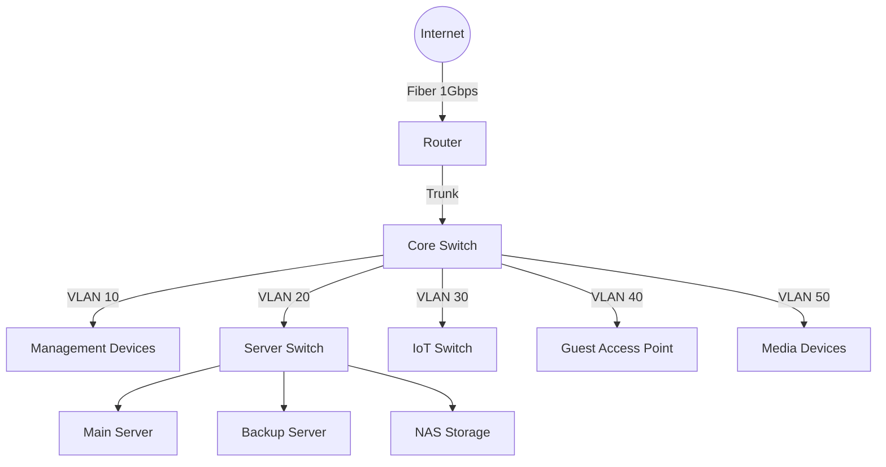

# Network Infrastructure

This section contains documentation for all network-related components in your home lab.

## Overview

Your home network is designed with security, reliability, and performance in mind. It features segmented VLANs for different types of devices, robust routing, and comprehensive monitoring.

## Network Topology

The network follows a hierarchical design:

## Key Components

| Device | Model | IP Address | Purpose |
|--------|-------|------------|---------|
| Router | pfSense | 10.0.10.1 | Main router/firewall |
| Core Switch | Unifi USW-24-POE | 10.0.10.2 | Core network switch |
| Server Switch | Unifi USW-16-POE | 10.0.10.3 | Server rack switch |
| Wi-Fi AP | Unifi U6-Pro | 10.0.10.4 | Main wireless access point |
| IoT AP | Unifi U6-Lite | 10.0.10.5 | IoT devices access point |

## VLAN Configuration

| VLAN ID | Name | Subnet | Default Gateway | DHCP Range |
|---------|------|--------|----------------|------------|
| 10 | Management | 10.0.10.0/24 | 10.0.10.1 | 10.0.10.100-10.0.10.200 |
| 20 | Servers | 10.0.20.0/24 | 10.0.20.1 | 10.0.20.100-10.0.20.200 |
| 30 | IoT | 10.0.30.0/24 | 10.0.30.1 | 10.0.30.100-10.0.30.200 |
| 40 | Guest | 10.0.40.0/24 | 10.0.40.1 | 10.0.40.100-10.0.40.200 |
| 50 | Media | 10.0.50.0/24 | 10.0.50.1 | 10.0.50.100-10.0.50.200 |

## Firewall Rules

The network uses a default-deny policy with specific allow rules:

- Management VLAN can access all other VLANs
- Server VLAN can access the internet on specific ports (80, 443, etc.)
- IoT VLAN can only access the internet, not other VLANs
- Guest VLAN can only access the internet
- Media VLAN can access the Server VLAN for media content

## DNS Configuration

The network uses a multi-layered DNS approach:

1. Local DNS server (Pi-hole) at 10.0.10.53
2. Upstream DNS using DNS-over-HTTPS to Cloudflare
3. Local domain `.home.lab` for internal services

## Monitoring

Network monitoring is handled by:

- Unifi Controller for network devices
- Grafana dashboards for traffic visualization
- Prometheus for metrics collection
- Uptime Kuma for service availability monitoring