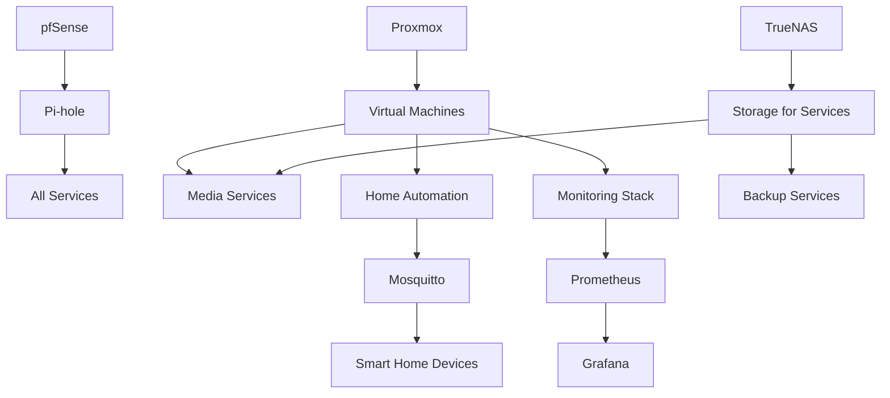

# Services Overview

This section documents all the services running in your home lab infrastructure.

## Core Services

| Service | Purpose | URL | Server | Port |
|---------|---------|-----|--------|------|
| Proxmox | Virtualization | https://proxmox.home.lab:8006 | Main Server | 8006 |
| TrueNAS | Storage | https://truenas.home.lab | NAS | 443 |
| pfSense | Routing/Firewall | https://pfsense.home.lab | Router | 443 |
| Unifi Controller | Network Management | https://unifi.home.lab:8443 | Main Server | 8443 |
| Pi-hole | DNS/Ad Blocking | http://pihole.home.lab/admin | Main Server | 80 |

## Media Services

| Service | Purpose | URL | Server | Port |
|---------|---------|-----|--------|------|
| Jellyfin | Media Server | http://jellyfin.home.lab | Media VM | 8096 |
| Sonarr | TV Show Management | http://sonarr.home.lab | Media VM | 8989 |
| Radarr | Movie Management | http://radarr.home.lab | Media VM | 7878 |
| Prowlarr | Indexer Management | http://prowlarr.home.lab | Media VM | 9696 |
| Transmission | Download Client | http://transmission.home.lab | Media VM | 9091 |

## Home Automation

| Service | Purpose | URL | Server | Port |
|---------|---------|-----|--------|------|
| Home Assistant | Smart Home Control | http://homeassistant.home.lab:8123 | Home Automation VM | 8123 |
| Node-RED | Automation Flows | http://nodered.home.lab:1880 | Home Automation VM | 1880 |
| Mosquitto | MQTT Broker | N/A | Home Automation VM | 1883 |
| ESPHome | ESP Device Management | http://esphome.home.lab:6052 | Home Automation VM | 6052 |
| Zigbee2MQTT | Zigbee Device Bridge | http://zigbee.home.lab:8080 | Home Automation VM | 8080 |

## Monitoring & Management

| Service | Purpose | URL | Server | Port |
|---------|---------|-----|--------|------|
| Grafana | Dashboards | http://grafana.home.lab:3000 | Monitoring VM | 3000 |
| Prometheus | Metrics Collection | http://prometheus.home.lab:9090 | Monitoring VM | 9090 |
| InfluxDB | Time Series Database | N/A | Monitoring VM | 8086 |
| Uptime Kuma | Uptime Monitoring | http://uptime.home.lab:3001 | Monitoring VM | 3001 |
| Portainer | Container Management | http://portainer.home.lab:9000 | Main Server | 9000 |

## Backup Services

| Service | Purpose | URL | Server | Port |
|---------|---------|-----|--------|------|
| Veeam | VM Backup | N/A | Backup Server | N/A |
| Duplicati | File Backup | http://duplicati.home.lab:8200 | Backup Server | 8200 |
| Syncthing | File Synchronization | http://syncthing.home.lab:8384 | Backup Server | 8384 |

## Service Dependencies

## Deployment Method

Most services are deployed using Docker containers managed through Docker Compose, with a few exceptions:

- Proxmox runs directly on the hardware
- pfSense runs directly on the router hardware
- Some VMs run specific applications without containerization

## Maintenance Schedule

| Service | Backup Frequency | Update Schedule | Maintenance Window |
|---------|------------------|-----------------|-------------------|
| Core Services | Daily | Monthly | Sunday, 2-4 AM |
| Media Services | Weekly | Bi-weekly | Saturday, 3-5 AM |
| Home Automation | Weekly | Monthly | Sunday, 4-6 AM |
| Monitoring | Monthly | Quarterly | Last Sunday, 2-4 AM |